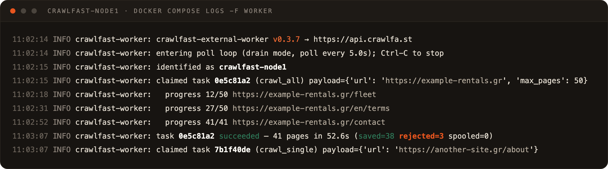
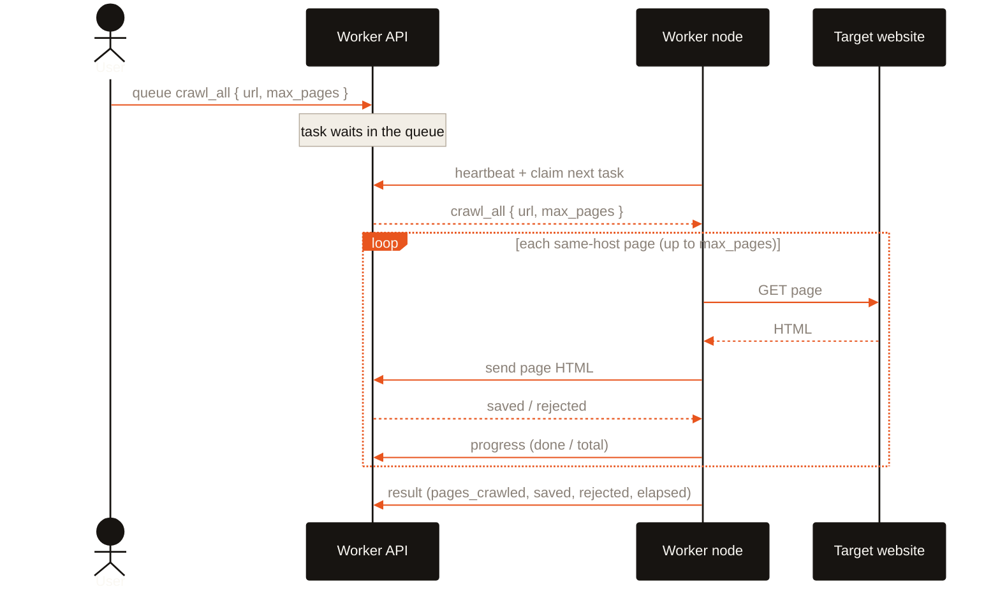
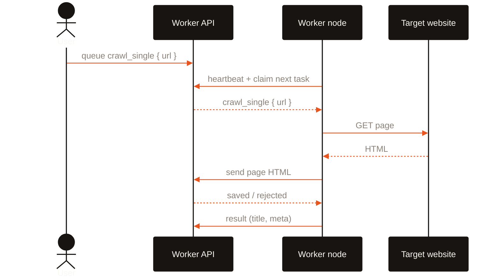
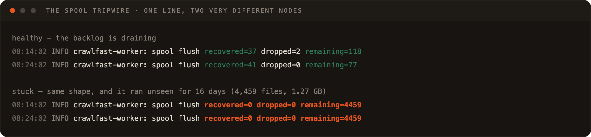
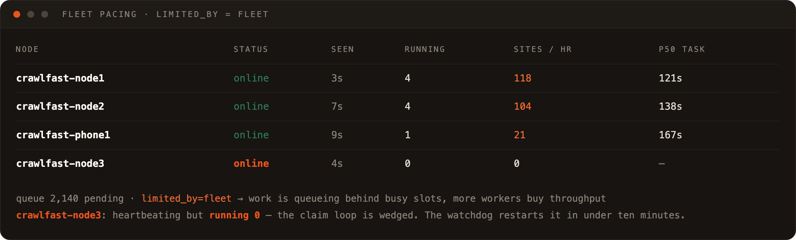

<div align="center">


# crawlfast external worker

**A crawl node you can leave on a shelf.**

*Pull-only* — the node dials the server, and nothing ever dials the node

No inbound ports · No database · No storage keys · One `config.yaml` · Pure `requests`, no browser

</div>

---

A crawler scales by having more places to crawl from. The usual way to buy those places is more
cloud instances, which is an expensive way to rent IP addresses that every WAF already knows.

This is the other way. Drop this repo on a spare laptop, an old Raspberry Pi or an Android phone,
give it a URL and a key, and it joins the fleet: it claims crawl tasks from the crawlfast API, does
them on a domestic connection, hands the HTML back, and reports what actually happened. It knows
**nothing** about the backend — no database URL, no S3 credentials, no application env. Its entire
world is an `api_base_url` and an `api_key`, so handing someone a node hands them nothing.



> **Spare Android phones make excellent nodes** — always on, silent, ~2 W, with a battery for a UPS,
> and no root required. See [ANDROID-NODE.md](ANDROID-NODE.md) for the Termux path.

## Why it is pull-only

The server cannot reach a laptop sitting behind someone's router, and arranging for it to be able to
— a tunnel, a port forward, a static address, a certificate — would be most of the work and all of
the risk. So the direction is inverted: the node claims, the node reports, the node heartbeats. The
server answers and never initiates.

Three things follow, and they shape everything below.

**There is nothing to expose.** No inbound ports, no tunnel, no reverse proxy, no inbound firewall
rule. A node works on a hotel Wi-Fi as readily as on the LAN it was provisioned on.

**Liveness is a heartbeat, not a probe.** "Is that node up?" can only mean "did it call recently".
Which is why a node can be `online` and still be doing nothing at all — heartbeat and claim are
separate calls, so a wedged claim loop still heartbeats happily. That failure is invisible from the
dashboard, so the worker [watches for it itself](#it-heals-itself).

**A node cannot be redeployed from CI.** The fleet is other people's machines on other people's
networks. Shipping a protocol break means visiting each one in person. That is why a small package
has [82 tests](#tests), and why every new transport behaviour defaults to *off*.

## The drain loop

The worker does not do one task per poll and then sleep. It **heartbeats on its own ~10 s cadence**
and otherwise claims work back-to-back for as long as the queue has any, so a distributed crawl runs
flat out with no gap between pages. It sleeps `poll_interval_seconds` only once the queue is
genuinely empty.

Per task it claims one unit of work, executes it, ships each crawled page's HTML to the server,
streams progress for multi-page tasks, and reports a final result.

| Call | Endpoint |
| --- | --- |
| Claim one task — atomic, returns nothing if idle | `POST /api/v1/external-worker/tasks/claim` |
| Ship one page's HTML — the server writes S3 + the `Page` row | `POST …/tasks/{id}/page` |
| Same, gzipped — used only if the server advertises it | `POST …/tasks/{id}/page-compressed` |
| Progress, for multi-page tasks | `POST …/tasks/{id}/progress` |
| The final result | `POST …/tasks/{id}/result` |
| Heartbeat — `worker_version` + the task types this node claims | `POST …/heartbeat` |
| Liveness, unauthenticated | `GET …/health` |

Every authenticated call carries the node's key as `X-Worker-Api-Key`. Claims are atomic on the
server (`FOR UPDATE SKIP LOCKED`), so no task is ever handed to two workers.

The executor is a registry — `task_type` → handler, in `crawlfast_external_worker/executor.py` — so
reaching parity with the internal Playwright worker later means registering a heavier handler with
the same signature, not rewriting the loop.

- **`crawl_single` · `crawl_single:meta` · `extract_meta`** — fetch one page, extract title and meta,
  ship its HTML.
- **`crawl_all` · `crawl` · `crawl_sitemap`** — BFS the whole site: follow same-host links up to
  `payload.max_pages` (default 50), skipping assets, streaming progress, shipping every page.

## What happens when you queue a task

The node only ever talks to the worker API. A user queues the crawl; the worker pulls it from that
same API, fetches public pages, and hands the HTML back. What the server does with that HTML — store
it, index it, score it — is none of the node's business.

### `crawl_all` — clone a whole site



### `crawl_single` — one page



## Quick start

```bash
cp config.example.yaml config.yaml && $EDITOR config.yaml
docker compose up -d --build
docker compose logs -f worker
```

```yaml
# config.yaml — the node's entire world
api_base_url: https://api.crawlfa.st     # or http://<api-box>.local:5099 on the LAN
api_key: cfw_...                          # minted server-side, one key per node
worker_name: crawlfast-node1
```

Without Docker:

```bash
pip install -r requirements.txt
python -m crawlfast_external_worker.worker            # the poll loop
python -m crawlfast_external_worker.worker --once     # a single cycle, for cron
python -m crawlfast_external_worker.worker --health   # just ping the API and exit
```

```cron
* * * * * cd /opt/crawlfast-external-worker && CRAWLFAST_WORKER_CONFIG=/opt/crawlfast-external-worker/config.yaml /usr/bin/python3 -m crawlfast_external_worker.worker --once >> /var/log/crawlfast-worker.log 2>&1
```

## Provisioning a node from scratch

One command turns a bare Linux or macOS box into a running node. Both provisioners are idempotent —
re-run either to reconfigure or upgrade.

**As a system service** (`setup-node.sh`) — installs prereqs into a venv, writes `config.yaml`, and
with `--service` installs a systemd unit that starts on boot and restarts on failure:

```bash
sudo apt-get update && sudo apt-get install -y git       # a truly fresh box
git clone https://github.com/pamfilico/crawlfast-external-worker.git
cd crawlfast-external-worker
./setup-node.sh --api-url http://api-box.local:5099 --api-key cfw_XXX --name crawlfast-node1 --service
```

Manage it with `journalctl -u crawlfast-worker -f` and `systemctl restart crawlfast-worker`.

**As a container** (`bootstrap.sh`) — installs Docker and mDNS, writes `config.yaml`, brings the
stack up. This is what the `onboard-crawlfast-node` skill runs over SSH:

```bash
./bootstrap.sh --api-url http://api-box.local:5099 --api-key cfw_XXX --name crawlfast-node2 [--scale N]
./bootstrap.sh --uninstall
```

`self-update.sh`, run from cron, pulls and — only if the code actually changed — rebuilds and
restarts, preserving the replica count. It is deliberately hard to brick a farm with it: a commit
that breaks the *build* leaves the old container running, and one that crashes at *runtime* is
retried by `restart: unless-stopped`. Push a fix and the fleet converges on its own.

### `.local` names, because DHCP moves

On Linux the provisioner installs avahi and aligns the hostname to `--name`, so the node answers to
**`<name>.local`** whatever its lease says (`ssh crawlfast-node1@crawlfast-node1.local`). It also
lets the node resolve *other* `.local` names — so point `--api-url` at the API box's mDNS name and
the node survives the **server's** address changing too. macOS advertises `.local` natively via
Bonjour (`scutil --get LocalHostName`).

### Enabling SSH first

Remote onboarding needs the box to already accept inbound SSH, and a fresh desktop install usually
ships the client without the server. Sitting at the machine, once:

```bash
curl -fsSL https://raw.githubusercontent.com/pamfilico/crawlfast-external-worker/main/setup-ssh.sh | bash
# or, from a clone:  ./setup-ssh.sh
```

Idempotent: it installs and enables `sshd`, opens the `ufw` rule if the firewall is on, and prints
the addresses to SSH to. The manual equivalents are `apt-get install openssh-server` +
`systemctl enable --now ssh` on Debian/Ubuntu, the same with `sshd` on Fedora/RHEL/Arch, and
`sudo systemsetup -setremotelogin on` on macOS.

Then, from your machine:
`advertcafe nodes onboard --host <box>.local --name crawlfast-node2`.

## Running more than one puller

```bash
docker compose up -d --build --scale worker=4      # four pullers, one node, one key
```

No `container_name` is set, so `--scale` just works. Replicas share the node's key and poll the same
queue; because claims are atomic, N replicas are N× throughput and never duplicated work. They also
share one host directory for the spool and the logs, so nothing is stranded inside a container.

For **distinct identities** — one per laptop, each with its own key:

```bash
export CRAWLFAST_WORKER_API_BASE_URL=http://192.168.1.10:5053
export WORKER1_KEY=cfw_...  WORKER2_KEY=cfw_...
docker compose -f docker-compose.multi.yml up -d --build
```

## Never lose a page

A crawl that reports success while its pages quietly went nowhere is worse than a crawl that fails,
because nothing ever looks wrong. So persisting a page is best-effort *but durable*
(`page_spool.py`): each page POST is retried with backoff, and if it still fails — a slow server, a
restart mid-crawl — the page is written to a local disk spool and re-POSTed on the next heartbeat.
Spooled pages survive a worker restart. A page is dropped only when the server permanently refuses
it, because its task is gone or has been reassigned to someone else.

That path is easy to write and easy to get wrong, so it can be exercised on purpose:
`CRAWLFAST_WORKER_FAIL_PCT=30` makes three page POSTs in ten fail with a transient error.



The flush line is the tripwire, and it is worth pinning to a wall. `recovered=0 dropped=0` with a
`remaining` that does not fall means the spool can neither land nor let go — it ran unnoticed for 16
days on one node and cost 1.27 GB of looping uploads. The writeup is `CRAWL_TASK_LEASE.md` in the
monorepo; the guard is `tests/test_page_spool.py`.

```bash
find .page-spool -name '*.json' | wc -l          # want 0
docker compose logs --since 1h worker | grep 'spool flush'
```

## The server's verdict, not the HTTP status

A `200` from the page endpoint does not mean the page was kept. So the worker counts what the server
says it did with each page:

| Outcome | Meaning | Retried? |
| --- | --- | --- |
| `saved` | Persisted to S3 and the `Page` row | — |
| `rejected` | The server got it and will not keep it: a 403 block page, a non-HTML body | **No** — retrying cannot help |
| `spooled` | The POST itself failed | Yes, from disk, on the next heartbeat |

Which is why a task log reads `saved=38 rejected=3 spooled=0` rather than one triumphant number. A
page the server refused no longer inflates `saved`, and the same three counts are folded into the
result the server stores, so the failure *rate* stays visible on the task and the website afterwards.

Every page outcome is also appended to a durable JSONL log on the node under
`logs/<client_id>/<lead_id>/<task_id>.jsonl`, with a `_summary` line per task. Each record stands on
its own — client, lead, website, task, url, outcome, reason, bytes — so the backlog can be shipped
whenever, from anywhere:

```bash
python post_logs.py --dry-run                    # show what would be posted
python post_logs.py                              # POST in batches, then move sent files aside
python post_logs.py --batch 1000 --url https://api.crawlfa.st
```

The `log-pusher` service in `docker-compose.yml` is that command on a timer — the "cron" as a compose
service, sharing the worker's host log directory, deleting each file only once the server confirms it
was stored.

## What the field taught it

Every row here is a change made because a real site defeated an earlier version. Most are guarded by
a test named after the symptom.

| The site did this | The worker now does this |
| --- | --- |
| WAF served `403` to a bot-shaped User-Agent and `200` to a browser | Sends a normal browser UA and `Accept-Language` |
| The lead carried a stale `www.` or `http://` that 403s, while the bare https host served fine | On a 4xx/5xx *only*, tries the other three spellings of the root domain and keeps the first that answers — a healthy site still costs exactly one request |
| Answered `429`/`503` under a burst | Waits the capped `Retry-After` and retries once |
| Blocked us permanently after a back-to-back BFS — then served everyone `200` again once left alone | `page_delay_seconds`, settable per task by the server, so a recrawl can be gentler than the first pass |
| Emitted `/en/en/company.php` relative links | Collapses repeated path segments, strips fragments and trailing slashes before queueing |
| Hid assets behind cache-busting queries (`/css_combine?css_cache=…`) | Skips them by hint as well as by extension, along with `&amp;`-encoded hrefs and `/cdn-cgi/`-style infra routes |
| Declared UTF-8 in a `<meta>` tag and nothing in the header | Decodes the bytes itself — `requests` calls that latin-1, and every such page was stored mojibake with nothing ever failing |
| Served a pathological body, or something that was not HTML at all | Caps the read at ~3 MB and skips non-HTML entirely |
| — | Optional pooled connection: a cold API call measured 255–400 ms, the same call warm, 67 ms |
| — | Optional gzip page bodies: 171,485 → 30,448 bytes on a real page, and only once `/health` says the server understands them |

The last two are the pattern for anything that touches the wire: **the flag defaults to off, and the
transport is discovered from the server rather than assumed from a version number**. A worker can
therefore roll out ahead of a backend deploy and keep using the old route until the new one appears.
`tests/test_config.py` exists to fail if a flag ever defaults on.

## It heals itself

The poll loop swallows transient errors, because a node must not die on a blip — but that is exactly
what creates the zombie: heartbeating forever, claiming nothing, indistinguishable from an idle
queue. So the watchdog measures **forward progress**, not liveness. No task processed for
`WORKER_WATCHDOG_IDLE_SECONDS` (default 600) and the process exits non-zero; `restart:
unless-stopped` brings up a fresh worker with fresh connections. No SSH, no operator.

## The fleet



The full runbook is [NODE-OPS.md](NODE-OPS.md). Two readings matter more than the rest:

**A node that is `online` with `running 0` while pending tasks sit at `attempts=0` is wedged**, not
idle — heartbeat and claim are different calls. Restart the worker, or let the watchdog do it.

**"Should I add machines?" is never answered by the queue depth**, which reads identically for a
healthy buffer and a stalled backlog. It is answered by `limited_by`: `fleet` means work is queueing
behind busy slots and another node buys throughput; `queue` means the nodes claim instantly and idle,
and another node buys nothing.

## Configure

Every value can come from `config.yaml` or the environment, and **the environment wins** — which is
what makes Docker, systemd and cron all workable without templating a file.

| Env var | Purpose |
| --- | --- |
| `CRAWLFAST_WORKER_API_BASE_URL` | API base URL (overrides `api_base_url`) |
| `CRAWLFAST_WORKER_API_KEY` | This node's key (overrides `api_key`) |
| `CRAWLFAST_WORKER_NAME` | Node name |
| `CRAWLFAST_WORKER_POLL_INTERVAL` | Seconds to sleep when the queue is empty (default 5) |
| `CRAWLFAST_WORKER_TIMEOUT` | Per-request HTTP timeout (default 30) |
| `CRAWLFAST_WORKER_CONFIG` | Path to `config.yaml` |
| `CRAWLFAST_WORKER_TASK_TYPES` | Comma-separated allow-list pinning this node to specific task types |
| `CRAWLFAST_WORKER_SPOOL` | Disk-spool directory (default `.page-spool`) |
| `CRAWLFAST_WORKER_LOG_DIR` | Per-client/per-lead JSONL logs (default `logs`) |
| `WORKER_WATCHDOG_IDLE_SECONDS` | No-progress budget before the self-heal restart (default 600) |

Opt-in behaviour, **all off by default** so an existing node is byte-for-byte unchanged until it asks:

| Env var | Purpose |
| --- | --- |
| `CRAWLFAST_WORKER_HTTP_SESSION` | Reuse one pooled TCP/TLS connection instead of dialling per request |
| `CRAWLFAST_WORKER_COMPRESS_PAGES` | gzip page bodies, if `/health` says the server takes them |
| `CRAWLFAST_WORKER_PAGE_DELAY_SECONDS` | Pause between page fetches on one site (a per-task value from the server wins) |
| `CRAWLFAST_WORKER_HOST_HEADER` | Override the `Host` header — to reach a Caddy vhost by IP |
| `CRAWLFAST_WORKER_NO_URL_VARIANTS` | `1` disables the root-domain fallback |
| `CRAWLFAST_WORKER_NO_RETRY` | `1` disables the `429`/`503` retry |
| `CRAWLFAST_WORKER_FAIL_PCT` | 0–100; inject that share of transient page-POST failures to exercise the spool (testing only) |

## The server side

Minting a key and queueing work needs the admin secret `EXTERNAL_WORKER_ADMIN_SECRET`. The key is
shown **once**.

```bash
curl -sX POST http://<backend>/api/v1/cli/nodes \
  -H "X-Crawlfast-Internal-Secret: $EXTERNAL_WORKER_ADMIN_SECRET" \
  -H 'Content-Type: application/json' \
  -d '{"name":"crawlfast-node1"}'

curl -sX POST http://<backend>/api/v1/cli/tasks \
  -H "X-Crawlfast-Internal-Secret: $EXTERNAL_WORKER_ADMIN_SECRET" \
  -H 'Content-Type: application/json' \
  -d '{"task_type":"crawl_single","payload":{"url":"https://example.com"}}'
```

## Tests

```bash
make test-worker              # from the monorepo root
python -m pytest              # from here, with requirements-dev.txt installed
```

**82 tests in about eight seconds.** No Docker, no database, no network: the suite serves its own
fixture website and its own crawlfast API on loopback, and a session fixture replaces
`socket.create_connection` with one that refuses anything but `127.0.0.1` — a crawler's test suite
must never be one typo away from crawling the internet.

| File | What it holds the line on |
| --- | --- |
| `test_client_protocol.py` | **The wire contract** — every envelope field the client reads, by name. Mirrored by the backend's `tests/contract/test_external_worker_protocol.py`, which asserts the server still sends them. Two suites, one contract. |
| `test_executor_crawl.py` | Link discovery and the traps it was written against: `&amp;` in hrefs, `/en/en/` duplicates, assets behind cache-busting queries, non-HTML bodies, `429` + `Retry-After` |
| `test_encoding.py` | Character encoding — the mojibake bug that failed nothing and corrupted everything |
| `test_page_spool.py` | saved / rejected / spooled, and that a reassigned task's page is dropped rather than re-flushed forever |
| `test_worker_loop.py` | Claim → run → report, and that the reported counts are the server's answers |
| `test_watchdog.py` | The self-heal: no progress ⇒ exit non-zero ⇒ respawn |
| `test_config.py` | Every transport opt-in defaults **off** |

Read [`tests/README.md`](tests/README.md) before changing `client.py`. The fleet's nodes cannot be
redeployed remotely, so a protocol change that ships is fixed by visiting each machine.

## Layout

```
crawlfast_external_worker/
  config.py       YAML + env → WorkerConfig (env wins; every opt-in defaults off)
  client.py       the worker API client (X-Worker-Api-Key, gzip discovery, fault injection)
  executor.py     task_type → handler registry; the fetcher and the BFS
  page_spool.py   durable disk spool — retry, buffer, flush, never lose a page
  task_log.py     per-client/per-lead JSONL result logs
  worker.py       the drain loop, the heartbeat cadence and the watchdog
config.example.yaml  requirements.txt  Dockerfile  docker-compose.yml  docker-compose.multi.yml
setup-node.sh (systemd)   bootstrap.sh (Docker)   self-update.sh (cron)   setup-ssh.sh (enable sshd)
post_logs.py (ship the JSONL backlog)   NODE-OPS.md (runbook)   ANDROID-NODE.md (phones)
```

Two runtime dependencies, `requests` and `PyYAML`. No browser, no Playwright, no database driver,
nothing to compile — which is the reason a phone can run it.

Current version: `__version__` in `crawlfast_external_worker/__init__.py` — **v0.3.7**.

## Part of crawlfast

The server half lives in the advert.cafe monorepo as `backends/crawlfast-backend`, which owns the
queue, the storage and the database this worker deliberately knows nothing about.
