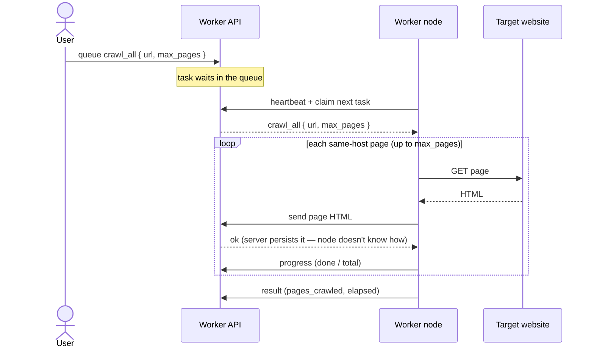
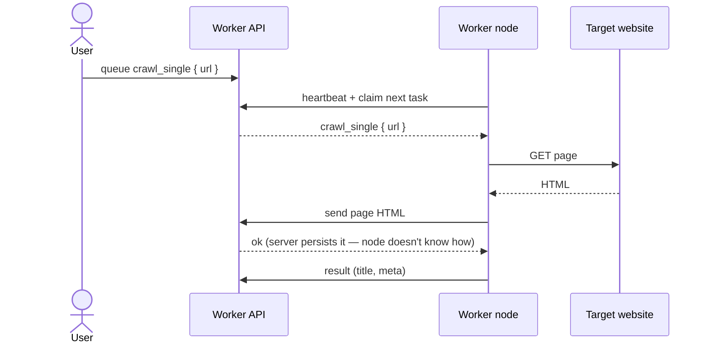

# crawlfast external worker

A tiny, self-contained **pull-based** crawl node. Drop it on any spare machine (an old laptop on
the LAN), give it a URL and an API key, and it will poll the crawlfast API for work, do it, and
report back. It knows **nothing** about the backend's database or secrets — its whole world is a
`config.yaml` with an `api_base_url` and an `api_key`.

> **Got spare Android phones?** They make great nodes, no root needed — see
> [ANDROID-NODE.md](ANDROID-NODE.md) for the Termux path (and the optional rooting path).

> **Pull-only by design.** The node dials the server; the server never dials the node. So there's
> nothing to expose, no inbound ports, no tunnel required. Health = "did the node heartbeat
> recently". (Server→node health/SSH orchestration comes later, once a tunnel/ngrok exists.)

## How it works

The worker runs a **drain loop**: it **heartbeats on its own ~10 s cadence** (not once per task) and
otherwise claims work back-to-back for as long as the queue has any, so a distributed crawl runs flat
out with no sleep between pages. Per task it:

1. **claims** one task — `POST /api/v1/external-worker/tasks/claim` (atomic; nothing if idle),
2. **executes** it (see the executor below),
3. **submits each crawled page's HTML** — `POST /api/v1/external-worker/tasks/{id}/page` — which the
   **server** persists to S3 + a `Page` DB row (the node holds no storage keys; the HTML never comes
   back to it),
4. **reports progress** for multi-page tasks — `POST /api/v1/external-worker/tasks/{id}/progress`,
5. **reports the final result** — `POST /api/v1/external-worker/tasks/{id}/result`.

Heartbeat: `POST /api/v1/external-worker/heartbeat` (sends `worker_version` + the task-type
`capabilities` this node will claim). Liveness: `GET /api/v1/external-worker/health` (unauth).
Auth is the `X-Worker-Api-Key` header on every call.

The executor (no browser, pure `requests`) — see `crawlfast_external_worker/executor.py` for the
handler registry / extension point to reach parity with the internal Playwright worker later:
- **`crawl_single` / `crawl_single:meta` / `extract_meta`** — fetch one page, extract title + meta,
  ship its HTML to the server (`pages_saved`).
- **`crawl_all` / `crawl` / `crawl_sitemap`** — **BFS the whole site**: follow same-host links and
  crawl every page up to `payload.max_pages` (default 50), skipping static assets (css/js/fonts/media,
  including query-string-bypassed ones), streaming incremental progress, shipping each page's HTML,
  and returning `pages_crawled` / `pages_saved` / `errors` / `elapsed_ms` (+ `elapsed_seconds`).

### Never lose a page — the durable spool

Persisting a page is best-effort-but-durable (`page_spool.py`): each page POST is **retried with
backoff**, and if it still fails (server slow/restarting → timeout) the page is written to a local
**disk spool** and re-POSTed on the next heartbeat/run — so a task never "succeeds" with pages
silently missing, and spooled pages survive a worker restart. A spooled page is dropped only when the
server permanently rejects it (task gone/reassigned). Spool dir: `.page-spool` (override with
`CRAWLFAST_WORKER_SPOOL`). To exercise this path on purpose, set `CRAWLFAST_WORKER_FAIL_PCT=<0-100>`
to make a fraction of page POSTs fail with a transient error (fault injection; off by default).

## What happens when you queue a task

High-level view — the node **only ever talks to the worker API** (the `/api/v1/external-worker/*`
endpoints). A **user** queues the crawl; the worker pulls it from that same API. It fetches public web pages
and hands their HTML back; what the server does with that HTML (store it, index it, whatever) is
none of the node's business. The node holds **no** storage keys and **no** database — just an
`api_base_url` and an `api_key`.

### `crawl_all` — clone a whole site

You queue one task with a URL; a single worker crawls **every same-host page** (up to `max_pages`,
default 50) and hands each page's HTML back to the API.



### `crawl_single` — one page

Same pull-and-report flow, but the worker fetches **just the one URL** (title + meta), hands its
HTML back, and finishes.



## Scaling — run 2+ workers

```bash
docker compose up --build --scale worker=4      # 4 concurrent pullers, one node/key
```
No `container_name`, so `--scale` just works. All replicas share this node's key and poll the same
queue; claims are atomic (`FOR UPDATE SKIP LOCKED`) so no task is ever processed twice — you get N×
throughput. For **distinct nodes** (separate identities, e.g. one per laptop) each with its own key:

```bash
export CRAWLFAST_WORKER_API_BASE_URL=http://192.168.1.10:5053
export WORKER1_KEY=cfw_...  WORKER2_KEY=cfw_...
docker compose -f docker-compose.multi.yml up --build   # node-1 + node-2
```

## Enable SSH first (on the target box)

Remote onboarding — the `advertcafe nodes onboard` CLI, or copying `setup-node.sh` over SSH —
needs the box to already **accept inbound SSH**. A fresh Linux desktop/laptop usually has the SSH
*client* but not the *server* (`sshd`), so `ssh <box>` is refused. Run this once, sitting at the
machine, to install + enable `sshd`:

```bash
# one-liner (no clone needed):
curl -fsSL https://raw.githubusercontent.com/pamfilico/crawlfast-external-worker/main/setup-ssh.sh | bash
# or from a clone:  ./setup-ssh.sh
```

It's idempotent, enables sshd on boot, opens the `ufw` SSH rule if the firewall is on, and prints
the address(es) to SSH to. The manual equivalents (paste them yourself if you prefer):

```bash
# Debian / Ubuntu
sudo apt-get update && sudo apt-get install -y openssh-server
sudo systemctl enable --now ssh

# Fedora / RHEL / Arch (unit is sshd, not ssh)
sudo dnf install -y openssh-server   # or: sudo pacman -S openssh
sudo systemctl enable --now sshd

# macOS — Remote Login
sudo systemsetup -setremotelogin on  # or System Settings → General → Sharing → Remote Login
```

Then, from your machine: `advertcafe nodes onboard --host <box>.local --name crawlfast-node2`.
(Optionally `ssh-copy-id <user>@<box>` first so it's key-based; otherwise the CLI uses `sudo_pass`
from `~/.advertcaferc`.)

## Provision a node from scratch (old or new machine)

One repeatable command turns a bare Linux/macOS box into a running node — installs prereqs, writes
`config.yaml`, and (with `--service`) installs a systemd service that runs on boot and auto-restarts:

```bash
# fresh machine (no git yet) — Debian/Ubuntu:
sudo apt-get update && sudo apt-get install -y git
git clone https://github.com/pamfilico/crawlfast-external-worker.git
cd crawlfast-external-worker
./setup-node.sh --api-url http://192.168.1.47:5099 --api-key cfw_XXX --name node-1 --service
```
`setup-node.sh` is idempotent (re-run to update/reconfigure). Drop `--service` to run in the
foreground, or use `--once` for a single cron-style cycle. Deps are reused if already present, else
a venv (or `pip --user`) is created — no manual Python setup.

Manage the service: `journalctl -u crawlfast-worker -f` · `systemctl restart crawlfast-worker`.

### Docker path — `bootstrap.sh` (+ self-update)

For a **Docker** node instead of a Python service, `bootstrap.sh` installs Docker + mDNS, writes
`config.yaml`, and `docker compose up -d` — same idempotent, one-command shape (this is what the
`onboard-crawlfast-node` skill runs remotely):

```bash
./bootstrap.sh --api-url http://api-box.local:5099 --api-key cfw_XXX --name crawlfast-node2 [--scale N]
./bootstrap.sh --uninstall
```

`self-update.sh` (run from cron) `git pull`s and, if the code changed, rebuilds + restarts the
container — **self-healing**: a commit that breaks the *build* leaves the old container running; one
that crashes at *runtime* is retried by `restart: unless-stopped`. It also persists the replica
`--scale` count across updates. Push a fix and the farm converges on its own.

### mDNS / `.local` — beat DHCP IP drift

On Linux the provisioner installs **avahi** and aligns the hostname to `--name`, so the node is
reachable as **`<name>.local`** regardless of its DHCP IP (`ssh crawlfast-node1@crawlfast-node1.local`).
It also lets the node **resolve other `.local` names** — so point `--api-url` at the API box's mDNS
name instead of its IP and the node survives the *server's* IP changing too:

```bash
./setup-node.sh --api-url http://my-macbook.local:5099 --api-key cfw_XXX --name crawlfast-node1 --service
```
(macOS advertises `.local` natively via Bonjour — `scutil --get LocalHostName` shows its name.)

## Configure

```bash
cp config.example.yaml config.yaml
# edit:
#   api_base_url: http://<backend-LAN-ip>:5053   (cloud later: https://api.crawlfa.st)
#   api_key:      cfw_...                          (provisioned server-side; worker A → key A)
```

Everything can also come from env vars (they win over the file), handy for Docker/cron:

| Env var | Purpose |
|---|---|
| `CRAWLFAST_WORKER_API_BASE_URL` | API base URL (overrides `api_base_url`) |
| `CRAWLFAST_WORKER_API_KEY` | this node's worker key (overrides `api_key`) |
| `CRAWLFAST_WORKER_NAME` | node name |
| `CRAWLFAST_WORKER_POLL_INTERVAL` | seconds to sleep when the queue is empty (default 5) |
| `CRAWLFAST_WORKER_TIMEOUT` | per-request HTTP timeout (default 30) |
| `CRAWLFAST_WORKER_CONFIG` | path to `config.yaml` |
| `CRAWLFAST_WORKER_TASK_TYPES` | comma-separated allow-list to **pin this node** to specific task types (e.g. `crawl_single`); default = everything it can run |
| `CRAWLFAST_WORKER_SPOOL` | disk-spool dir for failed page POSTs (default `.page-spool`) |
| `CRAWLFAST_WORKER_FAIL_PCT` | 0–100; inject that % of transient page-POST failures to exercise the spool (testing only, off by default) |

## Run

### Docker (the laptop path)
```bash
cp config.example.yaml config.yaml && $EDITOR config.yaml
docker compose up --build            # long-running poll loop
```

### Plain Python
```bash
pip install -r requirements.txt
python -m crawlfast_external_worker.worker                 # poll loop
python -m crawlfast_external_worker.worker --once          # single cycle (cron)
python -m crawlfast_external_worker.worker --health         # just ping the API
```

### Cron (every minute, single-shot)
```cron
* * * * * cd /opt/crawlfast-external-worker && CRAWLFAST_WORKER_CONFIG=/opt/crawlfast-external-worker/config.yaml /usr/bin/python3 -m crawlfast_external_worker.worker --once >> /var/log/crawlfast-worker.log 2>&1
```

## Provisioning a worker (server side, ops)

Ask the crawlfast API (needs the admin secret `EXTERNAL_WORKER_ADMIN_SECRET`):

```bash
# create a worker + get its key (shown once)
curl -sX POST http://<backend>/api/v1/cli/nodes \
  -H "X-Crawlfast-Internal-Secret: $EXTERNAL_WORKER_ADMIN_SECRET" \
  -H 'Content-Type: application/json' \
  -d '{"name":"crawlfast-node1"}'

# enqueue a task for workers to pull
curl -sX POST http://<backend>/api/v1/cli/tasks \
  -H "X-Crawlfast-Internal-Secret: $EXTERNAL_WORKER_ADMIN_SECRET" \
  -H 'Content-Type: application/json' \
  -d '{"task_type":"crawl_single","payload":{"url":"https://example.com"}}'
```

## Layout
```
crawlfast_external_worker/
  config.py       load YAML + env → WorkerConfig
  client.py       HTTP client for the worker API (X-Worker-Api-Key) + page-fault injection
  executor.py     task_type → handler registry (lite fetch + BFS crawl_all; on_page → server persists)
  page_spool.py   durable disk spool: retry page POSTs, buffer failures, flush later (never lose a page)
  worker.py       drain loop (~10s heartbeat, greedy claim; --once cron mode, --health)
config.example.yaml  requirements.txt  Dockerfile  docker-compose.yml  docker-compose.multi.yml
setup-node.sh (Python service)  bootstrap.sh (Docker)  self-update.sh (cron)  setup-ssh.sh (enable sshd)
ANDROID-NODE.md (Termux path)
```

*Current version: `__version__` in `crawlfast_external_worker/__init__.py` (v0.3.2 — page persistence +
durable spool + task-type pinning + fault injection).*
